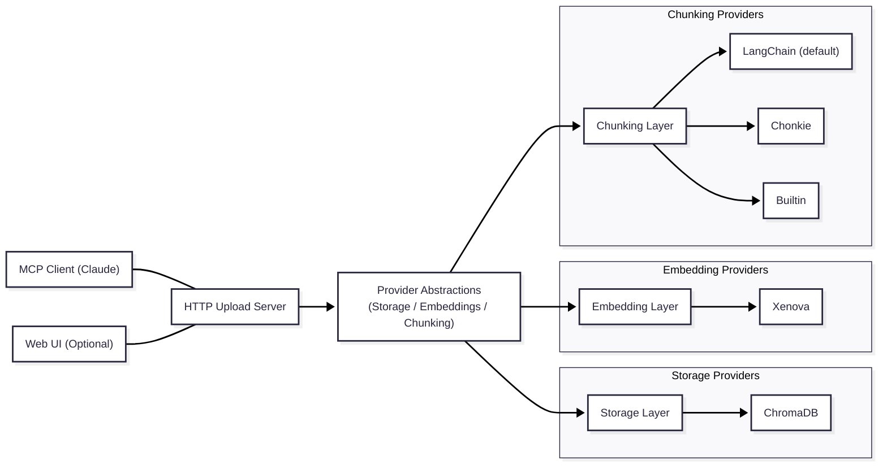

# CogniDocs - Documentation MCP Server - Flexible Backend

CogniDocs is a Model Context Protocol (MCP) server that provides AI assistants with the ability to search and query documentation. Now supports **flexible backend configurations** to meet different privacy and infrastructure requirements.

## 🆕 What's New - Flexible Backend Architecture

This version introduces a complete backend abstraction layer that allows you to choose your preferred technology stack:

### **Storage Options**

- **ChromaDB** - Open-source vector database

### **Embedding Options**

- **Xenova/Transformers** - Local, privacy-focused embeddings
- **Transformers.js (@huggingface/transformers)** - Official HF JS runtime (WASM by default on server)

### Provider registry and provider-agnostic configuration (New)

We now use a plugin-style provider registry with auto-registration. Configuration no longer references specific providers in the schema; instead you specify:

```bash
# Storage
STORAGE_NAME=chroma
STORAGE_OPTIONS={"url":"http://localhost:8000"}

# Embeddings
EMBEDDINGS_NAME=xenova
EMBEDDINGS_OPTIONS={"model":"Xenova/all-MiniLM-L6-v2","maxBatchSize":50}

# Alternative (Transformers.js)
# EMBEDDINGS_NAME=transformersjs
# EMBEDDINGS_OPTIONS={"model":"Xenova/all-MiniLM-L6-v2","device":"wasm","pooling":"mean","normalize":true,"maxBatchSize":50}
```

Notes:

- Providers self-register via `app/*/providers/index.ts` side-effect imports (e.g., `app/embeddings/providers/index.ts`, `app/storage/providers/index.ts`, `app/chunking/providers/index.ts`).
- Adding a provider is as simple as adding a new file that calls `register*Provider()`.
- Old variables like `STORAGE_PROVIDER`, `EMBEDDING_PROVIDER`, `CHROMA_URL`, `XENOVA_MODEL` are supported for backward-compat in parsing, but are deprecated.

### Chunking updates

- Default chunker is **LangChain** with the recursive strategy.
- Recommended defaults: `chunkSize=3000`, `chunkOverlap=150`.
- Configure via `CHUNKING_NAME=langchain` and `CHUNKING_OPTIONS={"strategy":"recursive","chunkSize":3000,"chunkOverlap":150}`.
- Additional strategies in the LangChain provider:
  - `intelligent`: content-type–aware splitting (adapts separators/size for code, markdown, html, etc.).
  - `semantic`: initial split + adjacent-merge when cosine similarity of embeddings is above a threshold.
- The Chonkie provider normalizes outputs to strings so `Chunk.text` is always a string.

## 🧭 Agentic Document Processing (ingestion, optional) (TODO)

Agent-guided chunking and annotation can dramatically improve search quality for large, multi-topic docs by aligning chunks to topic boundaries and enriching them with metadata (topic tags, section headings, code language, entities, summaries, and quality scores). This is designed to be an optional, provider-agnostic stage at ingestion time.

Learn more: see `docs/agentic-processing.md`.

## 🏗️ Architecture



## 🚀 Quick Start

[Installation & Setup](docs/installation.md)

### Privacy-Focused Setup (Local Only)

```bash
# Clone and install
git clone <repository>
cd cogni-docs
bun install

# Configure for local processing
cp .env.example .env
# Edit .env with provider-agnostic config:
STORAGE_NAME=chroma
STORAGE_OPTIONS={"url":"http://localhost:8000"}
EMBEDDINGS_NAME=xenova
EMBEDDINGS_OPTIONS={"model":"Xenova/all-MiniLM-L6-v2","maxBatchSize":50}

# Chunking (default: LangChain recursive)
CHUNKING_NAME=langchain
CHUNKING_OPTIONS={"strategy":"recursive","chunkSize":3000,"chunkOverlap":150}

# Start servers
# Start server (Upload + MCP on the same port)
bun run upload-server:prod  # Default :3001 (set HTTP_PORT). Use :dev for watch mode
```

### Hybrid Setup (ChromaDB + Local Embeddings)

```bash
# Start ChromaDB
docker run -p 8000:8000 chromadb/chroma

# Configure app
STORAGE_NAME=chroma
STORAGE_OPTIONS={"url":"http://localhost:8000"}
EMBEDDINGS_NAME=xenova
EMBEDDINGS_OPTIONS={"model":"Xenova/all-MiniLM-L6-v2"}

# Start app
bun run upload-server:prod
```

## 📋 Configuration Options

### Environment Variables

| Variable             | Type   | Description                                                                                                              |
| -------------------- | ------ | ------------------------------------------------------------------------------------------------------------------------ |
| `HTTP_PORT`          | number | Upload server port (default: 3001 in examples, config default 8787)                                                      |
| `STORAGE_NAME`       | string | Storage provider name (e.g., `chroma`)                                                                                   |
| `STORAGE_OPTIONS`    | JSON   | Provider-specific options as JSON (e.g., `{ "url": "http://localhost:8000" }` or `{ "projectId": "..." }`)               |
| `EMBEDDINGS_NAME`    | string | Embeddings provider name (e.g., `xenova`)                                                                                |
| `EMBEDDINGS_OPTIONS` | JSON   | Provider-specific options as JSON (e.g., `{ "model": "Xenova/all-MiniLM-L6-v2" }`)                                       |
| `CHUNKING_NAME`      | string | Chunking provider name: `langchain` (default), `chonkie`, or `builtin`                                                   |
| `CHUNKING_OPTIONS`   | JSON   | Provider-specific chunking options as JSON (e.g., `{ "strategy": "recursive", "chunkSize": 3000, "chunkOverlap": 150 }`) |
| `CHUNK_SIZE`         | number | Back-compat: target chunk size (default: 3000)                                                                           |
| `CHUNK_OVERLAP`      | number | Back-compat: overlap between chunks (default: 150)                                                                       |
| `MAX_CHUNK_SIZE`     | number | Back-compat: hard cap for chunk size (default: 5000)                                                                     |

See `.env.example` for complete configuration options.

### Chunking strategies (LangChain)

- `recursive` (default):
  ```bash
  CHUNKING_NAME=langchain
  CHUNKING_OPTIONS={"strategy":"recursive","chunkSize":3000,"chunkOverlap":150}
  ```
- `intelligent` (content-type aware: code/markdown/html get tuned separators & sizes):
  ```bash
  CHUNKING_NAME=langchain
  CHUNKING_OPTIONS={"strategy":"intelligent","chunkSize":3000,"chunkOverlap":150,"contentTypeAware":true}
  ```
- `semantic` (adjacent merge by embedding similarity):
  ```bash
  CHUNKING_NAME=langchain
  CHUNKING_OPTIONS={
    "strategy":"semantic",
    "chunkSize":3000,
    "chunkOverlap":150,
    "contentTypeAware":true,
    "semanticSimilarityThreshold":0.9,
    "semanticMaxMergeChars":6000,
    "semanticBatchSize":64
  }
  ```
  Notes:
  - Tweak `semanticSimilarityThreshold` (typ. 0.85–0.92) per corpus.
  - If embeddings are unavailable, the provider should fall back to the initial split (no merges).

Deprecated (still parsed for backward compatibility): `STORAGE_PROVIDER`, `EMBEDDING_PROVIDER`, `CHROMA_URL`, `XENOVA_MODEL`, `MAX_BATCH_SIZE`, `UPLOAD_SERVER_PORT`, `UPLOAD_SERVER_HOST`.

## 🔧 Technology Stack Comparison

| Feature              | ChromaDB + Xenova |
| -------------------- | ----------------- |
| **Privacy**          | ✅ Self-hosted    |
| **Performance**      | ✅ Good           |
| **Scalability**      | ✅ High           |
| **Setup Complexity** | ⚠️ Medium         |
| **Cost**             | 💰 Infrastructure |
| **Offline Support**  | ⚠️ Partial        |

## 🎯 Use Cases

### **Enterprise/Production**

→ **ChromaDB + Xenova**

- Automatic scaling
- Enterprise security
- Managed infrastructure

### **Privacy-Sensitive**

→ **ChromaDB + Xenova**

- No external cloud dependencies
- Complete data control
- Works in air-gapped environments

### **Development/Research**

→ **ChromaDB + Xenova**

- Easy experimentation
- Good performance
- Flexible deployment

## 📁 Project Structure

```
app/
├── index.ts                     # Starts HTTP Upload + MCP server
├── config/
│   └── app-config.ts            # Zod-validated, provider-agnostic config
├── chunking/                    # Chunking interface, factory, and providers
│   ├── chunker-interface.ts
│   ├── chunking-factory.ts
│   └── providers/               # Providers: langchain (default), chonkie, builtin
├── storage/
│   ├── storage-interface.ts     # Storage interface
│   ├── chroma-storage.ts        # ChromaDB implementation
│   └── storage-factory.ts       # Provider registry + factory
├── embeddings/
│   ├── embedding-interface.ts   # Embeddings interface
│   ├── embedding-factory.ts     # Provider registry + factory
│   └── providers/               # Embedding providers (e.g., Xenova)
├── server/
│   └── mcp-server.ts            # MCP tools + SSE transport (/sse, /messages)
├── ingest/
│   └── chunker.ts               # Ingestion entrypoint; uses chunking service
└── parsers/
    ├── pdf.ts                   # PDF parser
    ├── html.ts                  # HTML parser
    └── text.ts                  # Plain text parser
```

## 🔌 API Endpoints

### Upload Server (Port 3001)

- `GET /health` - Service health check with provider status
- `GET /sets` - List documentation sets
- `POST /sets` - Create documentation set
- `GET /sets/:setId` - Get specific set
- `GET /sets/:setId/documents` - List documents in set
- `POST /sets/:setId/upload` - Upload documents
- `DELETE /sets/:setId/documents/:docId` - Delete document

### MCP Server (HTTP SSE)

- Transport: `GET /sse` (event stream), `POST /messages` (JSON messages)
- Tools:
  - `list_documentation_sets` - List available sets
  - `get_documentation_set` - Get details about a specific set
  - `search_documentation` - Vector search within a set
  - `agentic_search` - Extractive, context-grounded answers

## 🛠️ Development

```bash
# Install dependencies
bun install

# Development with file watching
bun run upload-server:dev  # Upload+MCP server with hot reload
bun run web:dev            # Web UI development server

# Type checking
bun run typecheck

# Build for production
bun run web:build
```

## 🔍 Health Monitoring

Check service status:

```bash
curl http://localhost:3001/health
```

Response includes:

- Overall service health
- Storage provider status
- Embedding provider status
- System uptime

## 🤝 Contributing

The flexible backend architecture makes it easy to add new providers:

1. **Storage Provider**: Implement `StorageService` interface
2. **Embedding Provider**: Implement `EmbeddingService` interface
3. **Update Factories**: Add to respective factory files
4. **Configuration**: Add options to config schema

## 📄 License

MIT License - see LICENSE file for details.

A Model Context Protocol (MCP) server that provides AI assistants with the ability to search and query documentation using local-first, provider-agnostic backend.

## Architecture

This project implements a **dual-server architecture**:

1. **HTTP Upload Server** - For document ingestion and management
2. **MCP Server** - For AI assistants to query documentation

### Key Features

- **Multi-format parsing**: PDF, HTML, and plain text documents
- **Agentic search**: Extractive answers grounded in your documentation via MCP tools
- **Multi-tenant**: Multiple documentation sets with isolated search
- **Modern stack**: Bun runtime, TypeScript, Elysia framework

## Quick Start

### Prerequisites

- Bun runtime installed
- Docker (optional) for ChromaDB

### Setup

1. **Clone and install dependencies:**

```bash
bun install
```

2. **Configure environment:**

```bash
cp .env.example .env
# Edit .env with your provider-agnostic settings
```

3. **Start the upload server:**

```bash
bun run upload-server
```

4. **In another terminal, start the MCP server:**

```bash
bun run mcp-server
```

## Usage

### 1. Upload Documentation

Create a documentation set and upload files:

```bash
# Create a documentation set
curl -X POST http://localhost:3001/sets \
  -H "Content-Type: application/json" \
  -d '{"name": "My API Docs", "description": "REST API documentation"}'

# Upload documents (PDF, HTML, TXT)
curl -X POST http://localhost:3001/sets/{SET_ID}/upload \
  -F "files=@documentation.pdf" \
  -F "files=@api-guide.html"
```

### 2. Query via MCP

The MCP server exposes four tools:

- `list_documentation_sets` - List all available documentation sets
- `get_documentation_set` - Get details about a specific set
- `search_documentation` - Basic vector search within a set
- `agentic_search` - Agentic, context-grounded answers from your docs

### 3. Agentic Search Example

```typescript
// In Claude or another MCP-compatible AI assistant
await mcp.callTool("agentic_search", {
  setId: "your-set-id",
  query: "How do I authenticate API requests?",
  limit: 10,
});
```

## Configuration

### Environment Variables

```bash
# Core
HTTP_PORT=3001

# Provider-agnostic
STORAGE_NAME=chroma
STORAGE_OPTIONS={"url":"http://localhost:8000"}
EMBEDDINGS_NAME=xenova
EMBEDDINGS_OPTIONS={"model":"Xenova/all-MiniLM-L6-v2","maxBatchSize":50}

# Chunking
CHUNKING_NAME=langchain
CHUNKING_OPTIONS={"strategy":"recursive","chunkSize":3000,"chunkOverlap":150}
CHUNK_SIZE=3000
CHUNK_OVERLAP=150
MAX_CHUNK_SIZE=5000
```

## Development

### Scripts

```bash
bun run upload-server:dev  # Hot reload Upload+MCP server
bun run upload-server:prod # Production Upload+MCP server
bun run web:dev            # Web UI dev
bun run typecheck          # Type checking
```

### Adding New Document Types

1. Create parser in `app/parsers/`
2. Register/route the MIME type alongside existing parsers
3. Ensure chunking strategy in `app/ingest/chunker.ts` suits the new type

## Architecture Decisions

### Why Bun?

- **Performance**: Fast startup and runtime
- **TypeScript native**: No compilation step needed
- **Modern toolchain**: Built-in testing, bundling, package management

## Troubleshooting

### SSE transport disconnects

- Prefer `bun run upload-server:prod` (non-watch) for stability.
- Ensure your MCP client uses `GET /sse` (not POST) and `POST /messages`.
- If the IDE session gets stale, reload the MCP client to re-handshake.

### ChromaDB connectivity

- Verify Chroma is running and `STORAGE_OPTIONS={"url":"http://localhost:8000"}`.
- Check `GET /health` for storage status; restart Chroma if down.

### Embedding model setup

- Xenova/Transformers.js models download on first run; allow network access once if needed.
- Adjust `EMBEDDINGS_OPTIONS` (e.g., `maxBatchSize`) if you see memory warnings.
- If you change model/provider, embedding dimensions may differ. Use a fresh collection or reingest to avoid mixing dimensions.

## Future Enhancements

- [ ] Support for more document formats (DOCX, Markdown)
- [ ] Document metadata search and filtering
- [ ] Batch upload improvements
- [ ] Vector search optimization
- [ ] Authentication for upload server
- [ ] Metrics and monitoring

## Contributing

This project follows the user's coding guidelines:

- TypeScript with proper typing
- Functional programming patterns
- Modular architecture
- Comprehensive error handling

## License

MIT

To install dependencies:

```bash
bun install
```

To run:

```bash
bun run upload-server:prod
```

This project was created using `bun init` in bun v1.2.20. [Bun](https://bun.com) is a fast all-in-one JavaScript runtime.
